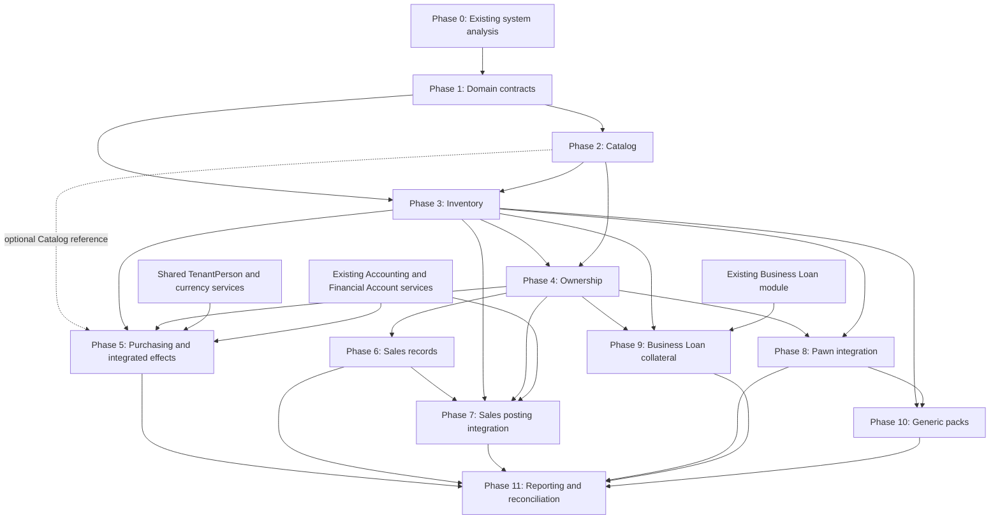

# Asset, Inventory, Ownership, Purchasing, and Sales Development Plan

This plan describes the current LonePawn Laravel/React modular monolith and the implementation sequence. Phase 5 has been expanded to include the complete Purchasing, Inventory, Ownership, Accounting, Financial Account, and supplier financing workflow. Remaining phases continue to track future work. Task IDs are intentionally small so implementation can be reviewed incrementally.

## Recommended Development Order

| Phase | Module | Main Deliverable | Depends On | Reason For Order |
|---|---|---|---|---|
| 0 | Existing system analysis | Reuse map, integration constraints, and migration risks | — | Capture current behavior before changing Pawn workflows or introducing parallel records. |
| 1 | Domain contracts | Names, ownership boundaries, invariants, references, and dependency direction | 0 | Prevent coupling and circular module dependencies before schemas are created. |
| 2 | Catalog | Minimal searchable definitions and quick-create selector | 1 | Enables reusable item descriptions without forcing unique collateral into a catalog. |
| 3 | Inventory | Locations, physical items/units, immutable movements, and balance queries | 1–2 | Physical custody must be reliable before any business operation uses it. |
| 4 | Ownership | Owned goods and acquisition lots with separate cost/value | 1–3 | Ownership depends on physical item references but remains distinct from location and catalog. |
| 5 | Purchasing and supplier financing | Complete purchasing flow with Catalog, Inventory, Ownership, Accounting, Financial Accounts, and receipt-linked supplier payables | 1–4; shared person/currency and existing finance services | Make the end-to-end purchase and return process testable now. |
| 6 | Sales records | Sale and item records with cost snapshots and API calls | 3–4 | Record sale intent against owned lots before implementing stock and ledger effects. |
| 7 | Sales posting integration | Connect posted Sales to stock, Ownership, and financial ledgers | 3–4, 6; existing Accounting and Financial Account services | Purchasing effects are implemented in Phase 5; this phase completes Sales posting. |
| 8 | Pawn integration | Custody receive/return and later ownership conversion | 3–4 | Integrate after the generic custody and ownership contracts exist; preserve Pawn behavior. |
| 9 | Business Loan collateral | Pledges, lender movements, releases, and forfeitures | 3–4 | Pledges require tenant-owned quantity and reliable custody movements. |
| 10 | Generic pack/unpack | Ad-hoc physical InventoryPack operations | 3, 8 | Build after movement invariants are stable; keep the Pawn jewellery-pack schema intact. |
| 11 | Reporting and reconciliation | Operational views and transaction-to-ledger/stock reconciliation | 5–10 | Reconciliation follows the purchase, sale, Accounting, and movement records it compares. |

## Phase 0 — Existing System Analysis

**Goal:** Record the current architecture and behavior that the feature plan must preserve. This phase precedes schema design because Pawn collateral is created and released inside existing transactional workflows.

**Why now:** It confirms actual service boundaries, API guards, tenant scope, feature migrations, UI routing, and overlaps before proposing new records.

**Dependencies:** None.

**Phase 0 findings (verified in repository):**

| Area | Current implementation | Reuse / implication for later phases |
|---|---|---|
| Backend architecture | `app/Http/Controllers`, `app/Services`, `app/Repository`, `app/Models`, request/response data objects, custom exceptions, and migrations. Existing services coordinate operations and repositories own query logic. `loanpawn-server/codex_rules.md` and the Laravel backend skill prescribe controller → service → repository, typed DTOs, tenant-safe access, custom errors, and transactions for multi-step changes. | Follow the current layers. Each feature plan task should include migration/model/repository/service/DTO/controller/route work as appropriate; do not put business rules in controllers or cross-module queries in repositories. |
| Tenant resolution and scope | `ResolveTenant` sets `TenantContext` for the request and clears it in `finally`; it resolves tenant from authenticated tenant user/cookie, `X-Tenant-Code`, license key, tenant host, or request origin. `BelongToTenant` adds a global `tenant_id` scope when context has a tenant and fills tenant ID on create; it also exposes `scopeForTenant`. `BaseTenantService::resolveCurrentTenantId()` fails if no current tenant exists. | Use the trait on every new tenant-owned model and resolve tenant in services. The trait does not itself validate foreign references. If context is absent, its global scope is not added, so CLI/system paths must pass explicit tenant scope. Validate that every referenced row belongs to the same tenant. |
| Existing non-trait finance models | `FinancialAccount` and `FinancialAccountTransaction` carry `tenant_id` but do not use `BelongToTenant`; account access is mediated by `MultiAccountManagement`/repositories and account transaction services. | Do not assume every existing tenant table has automatic scoping. Reuse existing tenant-aware financial account lookup services instead of querying accounts directly from a new feature service. |
| Feature gates | Tenant API routes use middleware such as `tenant.feature:collateral_management`, `tenant.feature:business_loan_management`, `tenant.feature:accounting_management`, and `tenant.feature:multi_account_management`. `EnsureTenantFeature` delegates plan checking to `TenantLicenseService`. Features are registered in migrations and mapped to plans; `config/package_features.php` also contains package feature lists. | New API routes need server-side feature middleware; frontend gating alone is insufficient. Add feature registration and package mappings using the migrations/config behavior found in current features. Avoid silently granting a new feature to all packages. |
| Permissions | Route middleware uses `tenant.permission:<code>`. Codes are listed in `config/tenant_permissions.php`; role/user boolean columns are created by migrations; `TenantPermissionColumns` normalizes/evaluates permissions and defines implied list permissions; `TenantUserPermissionService` performs authorization. Collateral and Business Loan use explicit list/create/update/delete permissions. | For each new permission, update the canonical code config, tenant role/user schema, defaults/backfill policy, effective permission behavior, and frontend code/labels. The create permission is not implied by list access; preserve this separation unless a deliberate permission policy says otherwise. |
| Pawn collateral model | `PawnCollateralItem` (`app/Models/PawnModule/PawnCollateralItem.php`) is tenant-scoped/soft-deleted and stores loan contract, type, name, description, brand, image, estimated/material values, category/material IDs, gold weights, gemstone data, quantity, minimum retail price, and `item_status`. It has no current Inventory or Ownership relation. Migration `2026_04_08_140240_create_pawn_collateral_items_table.php` adds unique `(tenant_id, code)` and tenant/loan indexes. | Keep this model authoritative for Pawn collateral details and valuation. Later add nullable linkage/integration additively; do not reinterpret its quantity/value fields as generic stock/cost basis. |
| Pawn pack structure | `PawnCollateralPackItem` is a tenant-scoped child of `PawnCollateralItem`, with name, quantity, kyat/pal/yway, optional material type and image. Migration `2026_09_11_000002_add_collateral_packs.php` also adds `material_price_per_kyat` to collateral parent. `CollateralItemService` validates contained-item weights against parent pack weight and computes minimum retail value. Frontend `modules/collateral/components/PackItems.tsx` edits names/quantities and optional jewelry weights/material/images. | Reuse its UI ideas only. This is composition/valuation information for Pawn jewellery, not generic stock components: it lacks physical Inventory item/unit references and cannot be migrated directly into InventoryPackItem. |
| Pawn create and redemption flow | `LoanContractServices/ManagementService::create()` prepares collateral images, then creates slip, calls `CollateralItemService::createForSlip`, creates initial interest schedule, records accounting, posts financial account transaction, and audits inside a DB transaction. `PawnRedemptionService::createRedemption()` locks the slip, validates redemption, settles interest/debt, changes slip status, calls `CollateralItemService::redeemProcess()`, then records accounting and financial-account movements in its transaction. `redeemProcess()` locks collateral rows and marks them `redeemed`. Loan create/redemption reserve optional idempotency records through `TenantIdempotencyService`. | Inventory receipt/issue must be orchestrated at these existing business transaction boundaries. Do not replace the lifecycle. Add an explicit custody location decision because no current location exists. Preserve idempotency and avoid creating Ownership for ordinary collateral receipt. |
| Collateral service/API | `CollateralItemService` uses `CollateralItemRepository`, permission service, cache versioning, table code generation, image storage, default data, DB transactions, and optimistic `update_key` checks on edit. `CollateralItemRepository` provides tenant-scoped Eloquent queries through the model scope, row-lock lookups, pack-child save, and soft delete. `routes/api.php` exposes list/show/update/delete under `collateral-items` and `collateral_management`; collateral create for Pawn occurs through loan contract API. | Reuse these services for existing collateral behavior; add integration methods/contracts rather than a second collateral CRUD service. Keep image handling and update concurrency token intact. API evolution must preserve current request/response payloads. |
| Business Loan structure | `TenantBusinessLoan` is tenant-scoped/soft-deleted and stores lender, receipt financial account, principal/balance, interest configuration, description/tag, paid state, and creator. Related `TenantBusinessLoanInterestAccrual`, `TenantBusinessLoanPayment`, and `TenantBusinessLoanPaymentAllocation` record accrued interest, payment account, principal/interest split, allocation order, and accrual allocation. Migrations are `2026_09_10_000004` through `000006`. There is no collateral model, table, endpoint, or detail UI. | Add a Business Loan-owned collateral relation in a later phase; do not add pledge fields to the generic Inventory tables or infer existing pledges from free text. Existing lender relation is not an Inventory location by itself. |
| Business Loan lifecycle/accounting | `TenantBusinessLoanService` validates accounts, uses `TenantIdempotencyService` for create/payment, performs operations in `DB::transaction`, and invokes `TenantAccountingTransactionService` plus `FinancialAccountTransactionService`. Loan receipt posts liability accounting and account receipt; principal payment posts liability/account movement; interest payment posts expense/account movement. | Reuse current payment and accounting flow. Collateral pledge/release should be a separate subworkflow and must not interfere with loan principal/payment state. Forfeiture requires an explicit accounting decision if a posting is required, but must not be represented as Sales. |
| Accounting and Financial Accounts | `TenantAccountingTransactionService` exposes operation-specific recording methods including Pawn, debt, expense, capital, and Business Loan operations; it uses accounting days, reporting currency conversion, reference morphs, and list cache versioning. `FinancialAccountTransactionService` records typed account movements, links an optional accounting transaction, locks account records, and updates balance. `MultiAccountManagement` validates active/current-tenant accounts and assignments. Existing Accounting routes require `accounting_management` plus permissions; financial account routes require `multi_account_management`. | Integrate cash/payment effects through these established services and Financial Account selectors. Inventory movement is not a financial transaction. Purchase receipt recognition/reclassification and acquired-goods accounting treatment require a separate Accounting decision when Purchasing is designed; do not calculate it in Inventory. |
| Migration overlap scan | Repository search across `app`, `database/migrations`, and `routes` found Pawn collateral/category/material tables, Business Loan tables, and financial-account/accounting tables, but no existing CatalogItem, InventoryItem/Unit/Location/Movement, OwnedItem/AcquisitionLot, Supplier/PurchaseOrder/Receipt, generic InventoryPack, BusinessLoanCollateral, or Sale/SaleLine implementation. Existing `ItemCategoryType` and `MaterialType` are Pawn/master-data concepts, not the requested generic Catalog category/unit. | No feature schema needs to be merged with an existing generic inventory schema. Reuse is at the architecture/service/UI level; keep Pawn master data distinct from Catalog Category/Unit unless a later contract explicitly justifies shared ownership. |
| Frontend structure | React feature code is grouped under `src/modules/<module>` with services/types/pages/components. `moduleRegistry.ts`, `app/routes/router.tsx`, `app/routes/paths.ts`, `components/navigation/Sidebar.tsx`, `FeatureRoute`, `PermissionRoute`, `useFeatures`, and `usePermissions` control navigation/access. API services use `apiClient`; collateral service already handles nested form data and image FormData. Shared controls include `SearchableSelect`, `DataTable`, filters, form fields, financial amount input, and `FinancialAccountSelect`. | Implement each frontend domain in its own module. Catalog should initially be a shared selector/quick-create component, not a sidebar item. Business Loan collateral belongs in the Business Loan detail workflow; Inventory movement views belong to Inventory. |

**Completed analysis tasks:**

- [x] `AN-001` Backend layers, DTOs, exception, response, and migration conventions documented above.
- [x] `AN-002` Tenant resolution, model scope behavior, missing automatic scopes, and reference-validation requirement documented above.
- [x] `AN-003` Feature/package and permission registration paths documented above.
- [x] `AN-004` Pawn collateral CRUD, loan creation, redemption, pack semantics, locks, images, and idempotency traced above.
- [x] `AN-005` Business Loan schema/lifecycle/accounting traced; absence of collateral schema/routes/UI confirmed above.
- [x] `AN-006` Accounting/Financial Account services, transaction linkage, account validation, and accounting day concerns traced above.
- [x] `AN-007` Frontend module/routes/navigation/guards/service/components traced above.
- [x] `AN-008` Migrations/routes/models searched for overlapping requested concepts; current Pawn/master data overlap distinguished above.

**Phase 0 result / implementation constraints:** No code/schema/API/UI was changed in this phase. Later phases should use the existing layered Laravel and React patterns, tenant-scope all new records and validate references, integrate Pawn only through its current loan/redemption operations, keep Pawn jewelry packs untouched, reuse current accounting/account services, and add generic Inventory models because none currently exist.

**Backfill, transactions, locking, idempotency:** Existing Pawn create and redemption are transactional and use optional idempotency. Existing collateral edits use row locks and `update_key`. Backfill must be a later, dry-run-first command; active collateral can be mapped to custody only with explicit/default location policy, redeemed collateral must not be treated as currently held, and no legacy collateral is automatically tenant-owned. Business Loan payment posting is idempotent and transactional.

**Acceptance:** The findings above identify the current model/migration/service/API/UI owners, what can be reused, what does not exist, and where module integration must occur. All eight `AN-*` tasks are checked complete.

**Explicitly defer:** Schema edits, changing Pawn lifecycle, moving existing pack data, converting collateral to Ownership without legal acquisition, and applying any legacy backfill before location and eligibility rules are implemented.

## Phase 1 — Domain Contracts and Naming

**Goal:** Finalize the domain vocabulary, responsibility boundaries, service contracts, dependency rules, and invariants that later schemas and workflows must implement.

**Why now:** Later phases create tables and endpoints across multiple modules. Agreeing on identity, custody, and ownership now prevents duplicate physical stock and circular service dependencies.

**Dependencies:** Phase 0 findings are complete. This phase produces contract documentation only; no production schema, routes, permissions, or UI changes.

**Ordered tasks and completion criteria:**

1. **`DOM-001` — Assign domain ownership.** Record that Catalog owns reusable definitions; Inventory owns physical identity/location/movement; Ownership owns tenant entitlement, acquisition source, quantities, and cost lots; Purchasing owns supplier/order/receipt/return; Business Loan owns lender and supplier debt, loan payments, and pledge lifecycle; Sales owns sale transactions; Accounting and Financial Accounts own financial entries/balances. Shared `TenantPerson` identity lets one party be both lender and supplier. **Complete when** every planned operation has one owning module and other modules interact through its service contract.
2. **`DOM-002` — Fix core entity names and relationships.** Use `CatalogItem`, `Category`, `Unit`, `InventoryItem`, `InventoryUnit`, `InventoryLocation`, `InventoryMovement`, `OwnedItem`, and `AcquisitionLot`. `OwnedItem` represents tenant ownership of an InventoryItem; an OwnedItem can have multiple AcquisitionLots. **Complete when** the glossary distinguishes reusable catalog identity, physical identity, and ownership identity, and records that InventoryItem can exist without OwnedItem.
3. **`DOM-003` — Fix acquisition-lot semantics.** Each AcquisitionLot stores acquisition source/reference, date, acquired and remaining owned quantity, unit cost basis, and an estimated/current value snapshot as established by the ownership workflow. Lots preserve separate costs for repeated purchases. **Complete when** examples with two Charger purchases at different costs can be represented without duplicating CatalogItem or collapsing costs. FIFO and average costing remain unselected/deferred.
4. **`DOM-004` — Define tracking invariants.** `UNIQUE` is one physical item, ordinarily quantity one; `SERIALIZED` ties aggregate quantity to individual InventoryUnits with unique identifiers where supplied; `QUANTITY` tracks quantities without InventoryUnit rows. Movement rules preserve these invariants, and on-hand/owned/available quantities cannot become negative. **Complete when** receive, move, issue, pack, and partial-quantity examples have a consistent interpretation.
5. **`DOM-005` — Define Catalog optionality.** `catalog_item_id` is nullable on physical and ownership records. Names are descriptive search fields, may repeat, and do not identify a CatalogItem. SKU/barcode are nullable and not required. Unique jewellery may have no CatalogItem. **Complete when** the Charger duplicate-name and unique-necklace cases are explicitly covered.
6. **`DOM-006` — Define provenance and tenant validation.** Generic source references are nullable audit metadata (`source_module`, stable `source_type`, `source_id`), not foreign keys into business modules. The operation-owning service validates its source record and current tenant before invoking Inventory; Inventory validates tenant ownership of its own item/unit/location references. Store module/type values from a controlled set, not arbitrary user input. **Complete when** every cross-module write has a named validator and no generic Inventory schema requires `pawn_slip_id`, `business_loan_id`, `is_collateral`, or `is_pledged`.
7. **`DOM-007` — Define dependency and feature-gate matrix.** Catalog is optional to Inventory and Ownership. Inventory is required for Ownership operations. Purchasing requires shared counterparty and currency records; Inventory and Ownership are required only when receipt integration is enabled. Business Loan supplier financing uses existing Business Loan access and Accounting/Financial Account services. Pawn custody requires existing Pawn feature access plus Inventory; ownership conversion additionally requires Ownership. Business Loan collateral requires existing Business Loan access plus Inventory and Ownership. Sales requires Inventory and Ownership; financial posting uses existing Accounting/Financial Account gates and permissions. Generic Inventory packs require Inventory only. **Complete when** route/UI gating requirements and unavailable-dependency behavior are written for every module.
8. **`DOM-008` — Define operation guarantees and API boundary.** Business workflows coordinate their own record and call Inventory/Ownership/Accounting service actions; Inventory never calls business modules. All tenant-owned records use the repository’s tenant convention and every reference is tenant-checked. Multi-record stock/ownership operations run in one DB transaction, lock affected rows in a deterministic order, and use existing `TenantIdempotencyService` conventions for retryable mutations. Inventory movements are append-only; corrections use compensating movements. **Complete when** the contract specifies rollback, retry, lock, and history behavior and does not require a new event bus.

**Module dependency matrix:**

| Consumer/operation | Required capability | Optional capability | Owning service / rule |
|---|---|---|---|
| Catalog search/quick-create | Catalog feature | — | Catalog service; no inventory or ownership side effect. |
| Inventory receive/move/issue | Inventory feature | Catalog lookup | Inventory service; validates its tenant-owned item, unit, and locations. |
| Ownership acquire/reduce | Inventory + Ownership | Catalog | Ownership service manages entitlement/lots; Inventory service manages custody. |
| Purchase order/down payment | Purchasing for the order; Financial Account/Accounting for any actual down payment | Catalog | A purchase order creates no debt or ledger entry by itself; a down payment is a supplier advance/payment, not a purchase expense. |
| Purchase receipt with unpaid balance | Purchasing; Inventory/Ownership when integrated | Catalog | Each receipt creates a separate Supplier Payable for its remaining unpaid value; no cash receipt is recorded. |
| Supplier loan payment | Business Loan + Accounting/Financial Account | — | Business Loan owns principal/interest allocation; financial services record the actual cash movement and accounting classification. |
| Pawn collateral custody | Existing Pawn operation + Inventory | Catalog | Pawn orchestrates its collateral lifecycle; ordinary customer collateral creates no Ownership. |
| Pawn legal conversion to tenant property | Pawn + Inventory + Ownership | Catalog | Pawn validates conversion; Ownership links to the same InventoryItem. |
| Business Loan pledge/release/forfeit | Business Loan + Inventory + Ownership | Catalog | Business Loan owns pledge; Inventory handles custody; Ownership handles available/owned quantity. |
| Sale | Sales + Inventory + Ownership; existing Accounting/Financial Account access to post | Catalog | Sales owns Sale/SaleLine and coordinates stock, ownership, and financial posting. |
| Physical pack/unpack | Inventory | Catalog; Pawn context when displayed there | Inventory owns generic pack grouping and conservation rules. |

**Backend/database/models/services/APIs/permissions:** Phase 1 adds no production artifacts. Record the above public vocabulary and each service ownership boundary in this plan. In later phases, expose typed service inputs/outputs using existing request/response data-object patterns; route guards combine required feature gates and permissions. Do not invent a shared cross-module repository or arbitrary table access.

**Frontend/reuse:** Phase 1 adds no UI. Later feature modules use current `src/modules/<module>` service/type/page structure and `apiClient`; Catalog begins as a selector/quick-create surface rather than primary navigation. UI guards mirror, but never replace, server route gates.

**Backfill:** Existing `PawnCollateralItem` stays the Pawn relationship. Historical active collateral is not automatically tenant-owned. Any future custody backfill must be dry-run-first, idempotent, and require an explicit/default location policy; redeemed collateral is not current custody. No conversion or data movement is performed in this phase.

**Transactions/locking/idempotency:** The workflow-owning service starts the transaction and coordinates other module service actions. Inventory and Ownership services validate and lock their own records; the contract will document a consistent lock order before implementations are written. Stock-affecting requests use the established optional idempotency service pattern. Movement history is immutable.

**Edge cases and acceptance:** The contract must classify generic Charger as optional Catalog identity, unique jewellery as Inventory without Catalog and initially without Ownership, Pawn collateral as custody without Ownership, purchase receipt as the point where stock/ownership are created, pledge as unavailable-but-still-owned, forfeiture as ownership loss rather than sale, and sale as a separate business operation. Acceptance is that all scenarios and module dependencies above can be implemented without a cyclic dependency or Inventory-specific Pawn/Business Loan columns.

**Explicitly defer:** Production migrations/models/endpoints/UI, complete event infrastructure, microservices, Catalog variants or bundle logic, SKU/barcode uniqueness policy, FIFO/average costing, and POS APIs.

## Phase 2 — Minimal Catalog

**Goal:** Implement reusable internal item definitions and a fast selector/quick-create flow.

**Why now:** Inventory and purchase screens benefit from reuse, but Catalog is intentionally not a prerequisite for unique goods because its relation remains optional.

**Dependencies:** Domain contract.

**Ordered tasks:**

- `CAT-001` Add Catalog feature and package mappings using the existing feature migration pattern.
- `CAT-002` Register tenant Catalog list/create/update permissions in backend permission config, permission columns/migration, normalization, role defaults, and frontend `permissionCodes`/labels.
- `CAT-003` Add tenant-scoped Category and Unit migrations/models, with active state and duplicate-friendly labels.
- `CAT-004` Add tenant-scoped CatalogItem migration/model with name, nullable descriptor/category/SKU/barcode, tracking mode, active state, and optional unit.
- `CAT-005` Add indexes for tenant/category/name/search and optional identifier lookup; do not impose unique name or required SKU/barcode.
- `CAT-006` Add Catalog repository queries for tenant-scoped search, active options, and create/update; do not identify by name.
- `CAT-007` Add typed request/response data objects and service validation for category/unit tenant ownership and tracking mode.
- `CAT-008` Add controller/API routes with `tenant.feature:catalog_management` and appropriate permissions.
- `CAT-009` Add frontend Catalog types/service and reusable searchable selector with quick-create.
- `CAT-010` Wire selector only into initial consuming flows as they arrive; do not add Catalog navigation yet.
- `CAT-011` Add tests for duplicate names, nullable SKU/barcode/category, inactive selection rules, invalid cross-tenant category, and tracking modes.

**Existing code to reuse:** `BelongToTenant`, Repository/Service/DTO/Controller layers, feature registration patterns (for example Business Loan feature migration), `SearchableSelect`, `apiClient`, `FeatureRoute`, and permission hooks.

**Database/models/services/APIs:** Tables `catalog_categories`, `catalog_units`, `catalog_items` (final names should match repository naming convention); models/repositories/services/data objects/controllers and a tenant-scoped search/quick-create endpoint.

**Frontend:** Selector must show category/descriptor context so identical names remain distinguishable; expose optional quick-create inline, not a full management section.

**Backfill/events:** No backfill required and no events needed. Catalog changes do not create Inventory or Ownership rows.

**Transactions/edge cases/acceptance:** Create item and optional initial metadata atomically. Acceptance: two “Charger” rows can coexist; “Charger / Phone Accessories” and “Charger / Laptop Accessories” are selectable; no SKU/barcode required.

**Explicitly defer:** Full category/unit administration UX, product variants, catalog bundles, uniqueness by name, required scan codes, Pawn data conversion, and POS barcode checkout.

## Phase 3 — Inventory Foundation

**Goal:** Implement physical location, units, append-only movement history, and quantity availability.

**Why now:** Purchasing receipts, Pawn custody, pledges, sales, and packs all depend on a consistent stock ledger.

**Dependencies:** Domain contract; optional Catalog selector/reference.

**Ordered tasks:**

- `INV-001` Add Inventory feature/package gate and backend/frontend registration.
- `INV-002` Add Inventory permissions for locations, list/detail, receive, move, issue, and adjustment, following tenant permission migrations.
- `INV-003` Add `InventoryLocation` with type `SHOP`, `STORAGE`, `VAULT`, `DISPLAY`, `LENDER`, or `OTHER`, active state, and tenant-scoped name.
- `INV-004` Add `InventoryItem` with tenant, optional catalog reference, tracking mode, display details, and any source provenance required by the contract.
- `INV-005` Add `InventoryUnit` for serialized physical units and unique identifiers (IMEI, serial number, or other identifier), validating duplicate identifiers within tenant scope.
- `INV-006` Add append-only `InventoryMovement` recording item/unit, from/to location, quantity, movement type, source reference, actor, occurred time, and idempotency key/reference.
- `INV-007` Add repository queries to calculate on-hand by item/location from movements; choose no balance cache initially unless measured query cost requires one.
- `INV-008` Implement Inventory service receive operation and tracking-mode validation.
- `INV-009` Implement move operation, including same-tenant locations, sufficient stock, and serialized unit custody.
- `INV-010` Implement issue operation; reject insufficient available quantity and already-issued/moved serialized units.
- `INV-011` Add typed APIs/controllers for location CRUD, inventory list/detail, receive/move/issue, units, and movement history.
- `INV-012` Add frontend Inventory list/detail, Locations, and Movement History pages with existing table/form components.
- `INV-013` Add tests for UNIQUE, SERIALIZED, QUANTITY, location movements, balances, insufficient quantity, tenant isolation, concurrency, and idempotency.

**Existing code to reuse:** `BelongToTenant`, tenant permission/feature middleware, repositories, service operations/transactions, DTOs, `TableIdGenerationService` where codes are appropriate, `TenantScopedCacheKeys` for cached lists, and `DataTable`/common forms.

**Database/models/services/APIs:** New inventory migrations/models/repositories/services/controllers/data objects. Generic Inventory schema contains no Pawn or Business Loan fields. Inventory stores no prices, profit, interest, liability, revenue, or expenses.

**Events/contracts:** Publish/use an explicit Inventory service contract. Prefer direct synchronous service orchestration while changes share one database; add domain events only for post-commit independent side effects, not to hide transactional stock changes.

**Backfill:** None in the generic foundation. Create a default location only through explicit tenant setup/initialization, with a migration strategy consistent with existing tenant setup.

**Transactions/locking/idempotency:** Lock balance-relevant item/unit rows before move/issue, append movement in the same transaction, enforce idempotency for receive/issue requests, and define deterministic lock ordering. Never update/delete historical movement to “correct” stock; corrections are new movements.

**Edge cases/acceptance:** Reject cross-tenant CatalogItem/location/unit references; support zero stock; UNIQUE normally quantity 1; SERIALIZED unit count reconciles to quantity; QUANTITY has no per-unit rows. Acceptance: receive/move/issue and movement history reconcile for all three tracking modes.

**Explicitly defer:** Reservations, stock counts, advanced transfer documents, InventoryPack, valuation, cost accounting, POS stock, and movement dashboard.

## Phase 4 — Ownership Foundation

**Goal:** Record what the tenant owns and why, with partial quantity and separate acquisition lots.

**Why now:** Ownership is needed before purchasing receipts, Business Loan pledges, and Sales can safely alter tenant entitlements.

**Dependencies:** Inventory and domain contracts.

**Ordered tasks:**

- `OWN-001` Add Ownership feature and package mappings.
- `OWN-002` Add Ownership permissions and role/user permission registration.
- `OWN-003` Add `OwnedItem` tenant model/table linked to InventoryItem, optional CatalogItem, and ownership lifecycle data.
- `OWN-004` Add `AcquisitionLot` with source reference, acquisition date, acquired/remaining quantity, per-unit cost basis, estimated/current unit value, currency, and description.
- `OWN-005` Define quantity invariants and reductions by operation (sold, pledged, forfeited, other allowed disposal) without one overloaded status field.
- `OWN-006` Implement Ownership service operations for acquisition, available quantity lookup, pledge reservation/release, sale reduction, and forfeiture reduction; keep physical movement delegated to Inventory service.
- `OWN-007` Add APIs/controllers for owned item and lot listing/detail/history; avoid Purchase/Sale UI inside Ownership.
- `OWN-008` Add frontend Owned Items list/detail showing owned/available/pledged quantities, cost lots, valuation, and Inventory location.
- `OWN-009` Add tests for multiple cost lots, unique goods with null catalog, partial owned quantity states, and cross-tenant Inventory references.

**Existing code to reuse:** Tenant-scoped model/repository/service/DTO patterns, response objects (never leak raw model contracts), and frontend module page/service conventions.

**Database/models/services/APIs:** Use `owned_items` and `acquisition_lots` naming unless local table naming review in `AN-008` finds a conflicting convention. Keep Inventory quantity and Ownership entitlement separately queryable.

**Events/contracts:** Ownership service is called by Purchasing, Business Loan collateral, Sales, and Pawn conversion; it calls Inventory lookup only where needed and must not mutate Inventory tables directly.

**Backfill:** No automatic ownership backfill. Existing Pawn collateral is customer property unless a later explicit legal acquisition operation says otherwise.

**Transactions/locking/idempotency:** Lock lot rows for reductions; sum remaining lot quantity; prevent below-zero ownership. Caller operation and Ownership changes share a transaction. Keep a stable acquisition source reference to prevent duplicate acquisition on replay.

**Edge cases/acceptance:** Same CatalogItem may have multiple lots and distinct costs; unique necklace can be OwnedItem quantity 1 with null CatalogItem; quantity lot can be partly sold and partly pledged while Inventory separately tracks location. Acceptance includes the stated 50×4,000 and 30×4,500 lots.

**Explicitly defer:** Full FIFO or average costing, accounting revaluation, tax treatment, sale UI, and a broad “asset status” state machine.

## Phase 5 — Purchasing with Inventory, Ownership, and Accounting

**Goal:** Implement the complete purchase lifecycle: supplier, order, receipt, return, physical stock movement, ownership acquisition and reduction, cash activity, asset/liability accounting, and receipt-linked supplier payables.

**Why now:** The end-to-end process must be testable as one workflow. Purchasing owns the orchestration, while Catalog, Inventory, Ownership, Accounting, and Financial Accounts retain their data and rules behind service contracts.

**Dependencies:** Phases 1–4, shared `TenantPerson` and tenant currency records, and existing Accounting and Financial Account services. Catalog references are optional; freeform purchase items remain supported.

**Ordered tasks:**

- `PUR-001` Add Purchasing feature/package gate and tenant permissions for suppliers, orders, payments/refunds, receipts, and returns. Receipt and return actions also require Inventory, Ownership, and Accounting access; cash operations require Financial Account access.
- `PUR-002` Add a Supplier profile linked to shared `TenantPerson`; allow existing customer/lender identities or a new party without duplicating shared contact details. Keep supplier behavior in `PurchaseSupplierService`.
- `PUR-003` Add purchase order headers and purchase items with currency and snapshotted descriptions, tracking mode, unit, quantity, and unit price.
- `PUR-004` Add receipt and receipt item records supporting partial fulfillment, location, serialized unit references, Inventory/Ownership links, and received value.
- `PUR-005` Add return and return item records linked to receipt items; record returned unit identifiers, supplier credit, cash refund, and the corresponding account/ledger references.
- `PUR-006` Add supplier advances before receipt through Financial Account and Accounting services. Validate same-currency active accounts and prevent advance/refund amounts from exceeding order/payment balances. Use Purchasing payable payments for later supplier settlements.
- `PUR-007` On receipt, lock order items, validate cumulative received quantities, receive physical goods through Inventory at a selected location, and acquire Ownership lots sourced to each receipt item. Reuse the same Inventory identity for quantity/serialized goods across partial receipts; create distinct identities for unique goods.
- `PUR-008` Create one Supplier Payable per receipt for its remaining unpaid value after applicable advances and credits. This is a non-cash liability entry with no financial-account receipt. Purchasing remains authoritative for supplier balances, while Business Loans remain a separate financing record.
- `PUR-009` On return, validate against received and previously returned quantities/serialized identifiers, issue the goods from the selected location, and reduce the corresponding receipt AcquisitionLot. Apply non-cash supplier credit to the receipt payable; record a cash refund separately through Financial Account and Accounting services. Preserve excess supplier credit as an asset advance available to apply to later receipts.
- `PUR-010` Expose tenant-scoped supplier, order, receipt, payment, and return APIs using generated business codes. Public payloads and response collections use `items` and business-code references.
- `PUR-011` Add frontend Purchasing API types/calls and a responsive workspace for supplier management, quick purchases, staged orders, partial receipts/returns, account/location selection, serialized identifiers, and supplier payable balances and codes.
- `PUR-012` Add English and Myanmar messages, loading/empty/error states, mobile layouts, and permission-aware actions. Clearly show incoming quantities separately from on-hand stock and display receipt-linked payable codes.
- `PUR-013` Add API validation for tenant ownership, currency compatibility, order/receipt/return limits, Inventory tracking rules, serialized unit uniqueness/custody, lot reductions, accounting-day restrictions, and idempotent replay.

**Existing code to reuse:** Tenant feature/permission middleware, tenant code generation and idempotency, Catalog lookup, Inventory and Ownership services, Supplier Payable services, Accounting and Financial Account transaction services, `FinancialAccountSelect`, and existing supplier/lender identity flows.

**Database/models/services/APIs:** Purchasing owns supplier, order, receipt, payment/advance, refund, and return records. Legacy database/model class names can remain for migration compatibility, while public API and UI terminology consistently uses items. `PurchasingService` orchestrates synchronous module service calls; it does not write directly to Inventory, Ownership, Accounting, or Financial Account tables. Supplier Payables are Purchasing-owned records separate from Business Loans; the frontend obligations registry presents both types together.

**Accounting treatment:** Advances reduce cash and create an asset advance. Receipt recognizes acquired goods as an asset; the unpaid remainder creates a Supplier Payable liability without cash movement. Return reduces stock asset and lot ownership; supplier-credit application reduces payable liability, while a cash refund increases the selected account. Any supplier credit exceeding the open payable remains a supplier credit available for a future purchase.

**Transactions/locking/idempotency:** The purchase operation owns the outer transaction. Lock order and receipt items before cumulative checks; Inventory locks item/unit balances and appends immutable movements; Ownership locks the selected lot before reduction; Supplier Payable locks the supplier balance before credit adjustment. Receipt and return effects, financial postings, and idempotency completion commit atomically.

**Edge cases/acceptance:** A staged order alone changes no stock or debt. Partial receipts create only received stock and ownership. Paid-in-full receipts create no payable; each unpaid receipt creates one payable for only its remaining value. Returns cannot exceed receipt quantity, re-return serialized units, issue units from a different location, or reduce another receipt’s lot. A return can combine cash refund and loan credit, and excess credit can reduce a later receipt balance. Replaying a request does not duplicate movements, lots, postings, payable adjustments, or supplier credits.

**Explicitly defer:** Advanced procurement approvals, vendor portals, invoice OCR, tax/shipping allocation, POS replenishment, and full FIFO/average cost policy. Core purchase Inventory, Ownership, Accounting, and supplier payable and credit flows are included in this phase.
## Phase 8 — Pawn Inventory Integration

**Goal:** Track custody of customer-owned collateral using Inventory while keeping Pawn collateral authoritative for Pawn relationships and valuation.

**Why now:** This safely reuses Inventory and Ownership contracts; doing it earlier would force Pawn-specific assumptions into generic tables.

**Dependencies:** Inventory and Ownership foundation; current Pawn behavior from Phase 0.

**Ordered tasks:**

- `PAWN-INV-001` Define integration gate and permissions that require both the existing Pawn collateral/loan feature and Inventory feature where applicable.
- `PAWN-INV-002` Add nullable InventoryItem reference to `PawnCollateralItem` through additive migration; do not drop or repurpose existing columns.
- `PAWN-INV-003` Add Pawn-side orchestration action that receives one collateral item into selected VAULT/OTHER location and records source reference; Ownership stays absent.
- `PAWN-INV-004` Integrate collateral receive into the existing loan-contract transaction after collateral record creation; preserve existing image preparation and loan accounting path.
- `PAWN-INV-005` Add redemption custody issue operation and call it in the existing redemption DB transaction alongside `redeemProcess`.
- `PAWN-INV-006` Add explicit “legally acquired collateral” conversion action: validate allowed Pawn status, create Ownership/AcquisitionLot, and point it to the same InventoryItem.
- `PAWN-INV-007` Keep PawnCollateralPackItem and its gold/material semantics; until generic pack phase, Inventory tracks parent pack as one custody object, not as independently movable children.
- `PAWN-INV-008` Add a dry-run backfill report for existing active collateral and an apply command that creates one InventoryItem/movement per eligible existing collateral record; redeemed rows are excluded from current custody.
- `PAWN-INV-009` Add error/retry repair path for partial historical mapping; preserve tenant scope and avoid duplicate Inventory records by stable source reference.
- `PAWN-INV-010` Extend collateral detail UI with current location and Inventory movement history, without changing the collateral editing workflow.
- `PAWN-INV-011` Add tests for loan create, redemption, customer ownership separation, conversion reuse, pack-parent custody, backfill dry-run/apply, and replay safety.

**Existing code to reuse:** `PawnCollateralItem`, `PawnCollateralPackItem`, `CollateralItemService`, `LoanContractServices\ManagementService`, `PawnRedemptionService`, `TenantIdempotencyService`, existing transaction/lock structure and collateral frontend forms/services.

**Database/models/services/APIs:** Add only nullable references or integration records needed for traceability; do not add Pawn slip columns to Inventory. Pawn service calls Inventory/Ownership service contracts. Existing collateral APIs remain backward-compatible; any location/conversion routes receive explicit feature and permission middleware.

**Frontend:** Reuse Collateral list/detail and add location/receive/conversion controls behind permissions. Preserve current jewelry detail and images.

**Backfill:** Dry-run first with tenant, collateral ID, active/redeemed state, proposed Inventory identity/location, and skipped/error reason. Apply is idempotent and must not create ownership.

**Transactions/locking/idempotency:** Loan collateral record and Inventory receive should commit atomically. Redemption locks Pawn slip/collateral then issues custody once; conversion locks the collateral and creates Ownership against existing inventory identity. Follow one documented lock ordering across both modules.

**Edge cases/acceptance:** Customer necklace held in Main Vault is in Inventory but not Ownership; redemption removes custody; legal acquisition creates Ownership without new InventoryItem; redeemed/cancelled/deleted legacy records are not blindly backfilled.

**Explicitly defer:** Replacing Pawn collateral tables, rewriting redemption, forcing all collateral into Catalog, converting weight subitems to InventoryUnits, and generic pack/unpack before Phase 9.

## Phase 9 — Business Loan Collateral

**Goal:** Record tenant-owned collateral pledges against Business Loans, with partial quantity and explicit release/forfeiture lifecycle.

**Why now:** It depends on reliable ownership quantity and generic Inventory location movement. Existing Business Loan operations remain otherwise intact.

**Dependencies:** Inventory, Ownership, and existing Business Loan feature/models/services.

**Ordered tasks:**

- `BL-COL-001` Register collateral permissions and require `business_loan_management`, `ownership_management`, and `inventory_management` on pledge operations.
- `BL-COL-002` Add `BusinessLoanCollateral` with tenant, loan, OwnedItem/lot reference, quantity, pledged value, status, pledged/released/forfeited dates, actor, and optional note.
- `BL-COL-003` Add database indexes/constraints for tenant and active pledge lookup; validate all linked records belong to the same tenant.
- `BL-COL-004` Implement pledge action: reserve owned quantity and move physical quantity from tenant location to a LENDER InventoryLocation; pledged value is independent of lot cost/value.
- `BL-COL-005` Implement release action: status RELEASED and move to tenant-selected return location; restore available owned quantity without creating another acquisition lot.
- `BL-COL-006` Implement forfeiture action: status FORFEITED, reduce ownership, and remove/move custody from tenant; do not create Sale or Sales accounting.
- `BL-COL-007` Add endpoints under the existing business-loan API surface with `update_business_loan` or a dedicated collateral permission; keep lender-loan payments separate.
- `BL-COL-008` Add Business Loan detail UI for pledge/release/forfeiture history and lender location selection.
- `BL-COL-009` Add tests for partial pledge/release, full forfeiture, cost basis vs estimated vs pledged value, paid-loan coexistence, tenant mismatch, and idempotency.

**Existing code to reuse:** `TenantBusinessLoan`, Business Loan controller/service and route feature gate, lender/location concepts, `TenantUserPermissionService`, Inventory and Ownership services, and loan detail page patterns.

**Database/models/services/APIs:** A Business Loan-owned `BusinessLoanCollateral` relation; do not modify existing loan principal/payment tables beyond relation/backfill needs. Inventory remains unaware of business loan columns.

**Events/accounting:** Loan payment/accounting remains with existing services. Pledge/release are non-sale stock/ownership events; forfeiture accounting treatment needs to be explicit with the existing Accounting service before that posting is enabled, but never represented as a normal Sale.

**Backfill:** No existing pledges are identified; none required. Do not infer collateral from Business Loan descriptions/tags.

**Transactions/locking/idempotency:** Lock loan, ownership lot and Inventory balance/unit in documented order; commit pledge record, quantity reservation, and movement atomically. Release/forfeiture only transitions from PLEDGED and replay returns the original result.

**Edge cases/acceptance:** Of 10 tenant-owned units, pledge 4: 6 available at shop and 4 at lender location; release returns those 4; forfeiture reduces tenant-owned total by 4 and creates no sale/profit line.

**Explicitly defer:** Lender custody confirmations, collateral substitution, multiple lenders per line, automatic loan covenants, and advanced collateral valuation.

## Phase 6 — Sales Records

**Goal:** Add draft Sales records and APIs, separate from stock and financial posting.

**Why now:** Sale details can be captured against the Ownership model before the later integration phase applies irreversible stock and ledger effects.

**Dependencies:** Inventory and Ownership references; existing customer/business code conventions.

**Ordered tasks:**

- `SALE-001` Add Sales feature/package gate and list/manage permissions.
- `SALE-002` Add `Sale` header with business code, date, optional buyer reference, currency, note, creator, and `DRAFT`/`CANCELLED` status.
- `SALE-003` Add `SaleLine` with owned-item/acquisition-lot business-code references, quantity, and unit selling price.
- `SALE-004` Add tenant-scoped list/detail/create/cancel APIs and typed frontend API calls; keep draft lines editable and do not add UI.
- `SALE-005` Validate tenant-owned references, tracking-mode quantities, and currency; do not reduce Ownership or Inventory in this phase.
- `SALE-006` Add tests for draft creation, code-based references, line validation, cancellation, tenant isolation, and idempotent replay.

**Database/models/services/APIs:** Sales owns `Sale` and `SaleLine`. Sale creation records a draft only; posting, cost snapshot, profit calculation, and stock/accounting effects belong to Phase 7. Use business codes in public APIs.

**Backfill:** None; do not infer sales from ownership changes.

**Explicitly defer:** Sale posting, cost snapshot/profit, ownership reduction, Inventory issue, Accounting/Financial Account transactions, POS, and sale UI.

## Phase 7 — Sales Accounting and Inventory Integration

**Goal:** Apply physical and financial effects when Sales records are posted. Purchasing receipt, return, supplier-debt, and cash flows are implemented and coordinated in Phase 5.

**Dependencies:** Phase 6 Sales records, Phases 3–4 Inventory/Ownership foundations, and existing Accounting and Financial Account services.

**Ordered tasks:**

- `INT-001` Add an explicit Sales posting action that locks and validates available owned and physical quantity, snapshots the selected acquisition cost, computes realized profit, issues Inventory, reduces Ownership, and records sale proceeds through Accounting and Financial Account services.
- `INT-002` Define the posting/cancellation boundary and accounting-day behavior so draft or cancelled Sales never move stock or post financial activity.
- `INT-003` Keep sale record, Inventory movement, Ownership reduction, cost snapshot, financial transaction, and accounting entries atomic and idempotent.
- `INT-004` Add tests for partial sale posting, cost/profit snapshots, insufficient or pledged stock, closed accounting days, rollback, and replay.

**Database/models/services/APIs:** Sales coordinates existing Inventory, Ownership, Accounting, and Financial Account contracts. Purchasing integrations are owned by Phase 5 and are not deferred here. Public references use business codes and collections use `items`.

**Backfill:** None. Existing expenses remain expenses; do not infer old receipts, returns, sales, stock, or ownership from other records.

**Edge cases/acceptance:** Draft sale creates no stock or ledger effect. Posting a sale for cost 800,000 and proceeds 1,050,000 reduces stock and ownership by the sold quantity, snapshots 800,000 cost, and records 250,000 realized profit. Pledged or insufficient stock cannot be sold.

**Explicitly defer:** POS checkout, complex sale refunds/exchanges, tax and shipping allocation, automated purchase-sale reconciliation, and new ledger types outside existing Accounting flow.
## Phase 10 — Generic Pack / Unpack

**Goal:** Support ad-hoc physical packs as Inventory operations while preserving component identity, quantity, location, and history.

**Why now:** Packing combines physical things and must use the stable generic Inventory ledger; it is not a Catalog commercial bundle.

**Dependencies:** Inventory foundation; Pawn integration knowledge; business restrictions from Ownership/pledges.

**Ordered tasks:**

- `PACK-001` Add pack/unpack permissions under Inventory feature access.
- `PACK-002` Add `InventoryPack` as a physical one-off container/grouping record with current location and lifecycle.
- `PACK-003` Add `InventoryPackItem` component rows supporting InventoryItem quantity, specific serialized InventoryUnit, or unique InventoryItem.
- `PACK-004` Define conservation invariant and model whether packing is grouping-only versus parent container stock; do not double-count components and pack as sellable stock.
- `PACK-005` Implement pack operation validating all components are at compatible location and not actively pledged/restricted; append traceable movement/grouping records.
- `PACK-006` Implement unpack operation restoring component availability and locations, preserving same InventoryItem/InventoryUnit identities.
- `PACK-007` Add APIs/controllers and a lightweight pack editor in Inventory and contextual collateral/owned item views.
- `PACK-008` Add adapter/integration for Pawn collateral packs where practical, retaining `PawnCollateralPackItem` as its domain jewelry-detail structure.
- `PACK-009` Add tests for one unique phone + one charger + one case, serialized IMEI preservation, quantity conservation, mixed tracking types, active pledge rejection, and retries.

**Existing code to reuse:** Pawn `PackItems`/collateral editor can inform component-entry UI only; current child schema stores names, quantities, weights, material, and images, so it is not directly migratable into generic packs.

**Database/models/services/APIs:** New Inventory-owned pack models and service methods; no reusable bundle schema in Catalog. Route under Inventory feature and pack permissions.

**Events/backfill:** No automatic migration of pawn pack children as stock components because they are descriptive gold composition data. Provide explicit conversion only if future domain requirements establish physical component identity.

**Transactions/locking/idempotency:** Lock all components in stable sorted order; ensure no component can be packed twice, issued, sold, or pledged while contained. Pack/unpack are atomic and idempotent.

**Edge cases/acceptance:** Packing/unpacking a phone with IMEI plus quantity charger/case preserves the exact component identities and quantities, with no duplicate inventory count. Active lender pledge conflicts reject packing.

**Explicitly defer:** Catalog reusable bundles, kits/BOM, nested packs, shipping cartons, multi-location transfer, and pack scanning.

## Phase 11 — Reporting and Reconciliation

**Goal:** Add operational views sourced from canonical business and movement records after the transactional flows are stable.

**Why now:** Dashboards built earlier would encode unsettled balance/status rules and risk becoming a second source of truth.

**Dependencies:** Purchasing, Sales, Phase 7 integrations, Pawn integration, Business Loan collateral, and generic pack semantics as needed by each report.

**Ordered tasks:**

- `RPT-001` Add Inventory on-hand by location, tracking mode, and item from movement balances.
- `RPT-002` Add Owned Items view separating total, available, pledged, sold, and forfeited quantities and acquisition lots.
- `RPT-003` Add incoming purchase view using ordered minus received line quantities; do not include as stock.
- `RPT-004` Add pledged goods list joined through BusinessLoanCollateral and Inventory lender locations.
- `RPT-005` Add Sale realized profit report from persisted SaleLine cost snapshots.
- `RPT-006` Add movement, purchase, supplier, Pawn collateral custody, and ownership history filters.
- `RPT-007` Reuse existing list/table/filter/mobile card patterns and ensure every view has loading, empty, error, and permission states.
- `RPT-008` Add reconciliation views comparing purchase receipts/returns, payments/refunds, sale postings, Inventory movements, Ownership lots, and Accounting/Financial Account records.
- `RPT-009` Add reconciliation tests comparing report totals to canonical transactions; show discrepancies for review and never silently rewrite source records.

**Existing code to reuse:** `DataTable`, `FilterBar`, `TableToolbar`, `DataCard`, `StatCard`, tenant-scoped list services/cache keys, and existing accounting/report date conventions where applicable.

**Database/models/services/APIs:** Prefer query/read services over denormalized report tables initially. Add summary snapshots only after measuring query needs and documenting rebuild semantics.

**Events/backfill:** No reporting event pipeline required initially. If read summaries are later needed, rebuild from source records and keep tenant-aware repair commands.

**Transactions/locking:** Reports are read-only and consistent with committed operations; movement and lot write locking belongs in earlier operation phases.

**Edge cases/acceptance:** Incoming quantities are not stock; pledged quantity remains tenant-owned but unavailable; forfeiture does not count as sold; profit uses sale-time cost snapshot. Every reconciliation result must trace to canonical source records.

**Explicitly defer:** Forecasting, automated reorder planning, margin recommendations, accounting valuation schedules, and executive dashboard work before reconciliation.

## Cross-Phase Integration Rules

- Every tenant-owned model/table uses `BelongToTenant` and every service validates referenced entities against `TenantContext`; never trust tenant IDs from client payloads.
- Protect APIs with the existing tenant feature and permission middleware. Register each new permission through the complete server config/migration/role/user/frontend code path.
- Keep controllers focused on request parsing and responses; put business logic in services and query logic in one primary repository per service, following repository conventions.
- Use typed request/response data objects and project custom exceptions/message codes; do not return raw Eloquent models as the public contract.
- Cross-module writes happen through explicit module service contracts/actions. Do not directly manipulate another module’s tables from arbitrary services.
- Keep a modular monolith; no microservices. Use synchronous contracts for transactional DB-local behavior and introduce events only for justified post-commit side effects.
- Inventory is custody/quantity only. Ownership tracks tenant entitlement and cost/value. Catalog is optional reusable identity. Purchasing, Pawn, Business Loan, and Sales own their business relationships. Accounting/Financial Account services own financial postings.
- Preserve append-only inventory movement history, idempotent stock-changing operations, and row locks around concurrent quantity changes.
- Feature gates should be independently assignable where meaningful: Catalog, Inventory, Ownership, Purchasing, and Sales. Pawn integration additionally depends on Pawn features; Business Loan collateral additionally depends on Business Loan. UI gates never replace server gates.

## Scenario Verification

| Scenario | Required result | Covered by |
|---|---|---|
| A — Lazy reusable purchase | Quick-create generic “Charger” without SKU, search/reuse it later, and permit another same-name item with different category/context. | CAT-003–011, PUR-005, PUR-012 |
| B — Online purchase | Phase 5 receives 8 then 7 of 20 into Inventory and Ownership, leaving stock 15 and incoming 5. | PUR-003–013 |
| C — Received but unpaid | Receipt of 10 creates 10 Inventory/Ownership units and a Supplier Payable for only the unpaid value. No cash receipt or duplicate AP balance is recorded. | PUR-004–009 |
| C2 — Supplier installment purchase | A supplier who is also a lender shares one `TenantPerson`; a down payment is a supplier advance, the received unpaid remainder creates a Supplier Payable, and payable installments reduce the supplier payable and record cash outflow without duplicate debt. | PUR-002, PUR-006–008 |
| D — Unique jewellery | Necklace works with quantity 1, no CatalogItem, and its own description/details through the purchase receipt workflow. | INV-004–013, OWN-003–009, PUR-003–009 |
| E — Serialized phone | One CatalogItem, quantity 3, three separately identified InventoryUnits/IMEIs through the purchase receipt workflow. | CAT-004, INV-004–013, PUR-003–009 |
| F — Pawn collateral | Receive to custody only; redemption issues; legal conversion attaches Ownership to the existing InventoryItem. | PAWN-INV-002–011 |
| G — Business Loan | Pledge 4 of 10, keep 6 available, move 4 to lender; release restores; forfeiture removes ownership but is not a sale. | BL-COL-002–009 |
| H — Sale | Phase 6 records a draft; Phase 7 posts a partial sale, issues inventory, snapshots cost and price, posts Accounting, and calculates realized profit. | SALE-002–006, INT-001–003 |
| I — Pack | Pack/unpack serialized phone and quantity charger/case without losing identities or quantities. | PACK-002–009 |

## Dependency Graph

## First 20 Tasks to Execute

1. `DOM-001` Define module responsibilities and prohibit arbitrary cross-module table writes.
2. `DOM-002` Fix core Catalog and Inventory model names.
3. `DOM-003` Select OwnedItem + AcquisitionLot ownership model.
4. `DOM-004` Define UNIQUE, SERIALIZED, QUANTITY invariants.
5. `DOM-005` Define optional Catalog reference and source/reference policy.
6. `DOM-006` Document allowed dependency direction and service contracts.
7. `DOM-007` Define tenant validation for every cross-module reference.
8. `DOM-008` Define feature gate boundaries, locking, idempotency, and operation transaction rules.
9. `CAT-001` Add Catalog feature gate and package mappings.
10. `CAT-002` Register Catalog permissions across backend and frontend.
11. `CAT-003` Add tenant Category and Unit records.
12. `CAT-004` Add CatalogItem schema/model with optional SKU/barcode/category and duplicate-friendly names.
13. `CAT-005` Add duplicate-friendly tenant/category/name and optional identifier indexes.
14. `CAT-006` Implement tenant-scoped Catalog search and create repository methods.
15. `CAT-007` Implement Catalog request/response objects and validation service.
16. `CAT-008` Add Catalog routes/controllers with feature and permission gates.
17. `CAT-009` Add frontend Catalog types/service and searchable quick-create selector.
18. `CAT-010` Embed the selector in the first consuming workflow without main navigation.
19. `CAT-011` Cover Catalog duplication, optional identifiers, tracking modes, and tenant validation.
20. `INV-001` Add Inventory feature gate and package mapping.

## Things We Should NOT Build Yet

- Do not create one large `AssetManagement` module, table, or service that combines Catalog, Inventory, Ownership, Purchasing, Pawn, Business Loan, Sales, and Accounting.
- Do not require CatalogItem for unique Pawn collateral/jewellery; do not require SKU/barcode/brand/detail metadata; do not make CatalogItem names unique.
- Do not put Pawn slip, Business Loan, pledged, or collateral-specific columns in generic Inventory tables.
- Do not count ordered or paid-but-not-received purchase goods as physical stock.
- Do not treat pledged goods as sold or Business Loan forfeiture as a normal Sale.
- Do not duplicate InventoryItem when collateral converts from customer custody to tenant ownership.
- Do not put profit, revenue, interest, liability, expense, or cost calculations in Inventory.
- Do not rewrite current Pawn collateral logic or migrate `PawnCollateralPackItem` directly to generic InventoryPackItem; its current records describe jewellery composition and gold weights.
- Do not build FIFO/average costing, reusable Catalog bundles, reservations, stock counts, complex transfers, procurement suite, cashier/register/cart, promotions, loyalty, barcode checkout, or complex refund system in the initial scope.
- Do not prioritize dashboards before purchase, custody, pledge, sale, and movement reconciliation works.
- Do not introduce microservices or broad abstraction layers where existing Laravel module service contracts suffice.

## Decisions Required Before Coding

No product decision blocks the initial analysis and foundation. Use these defaults and confirm repository conflicts during the stated task rather than asking the user to rediscover repository facts:

- Use `OwnedItem` plus `AcquisitionLot`; multiple lots may share one CatalogItem/physical owned aggregate and preserve independent unit cost.
- Allow `catalog_item_id` to be null for unique items and generic one-off goods.
- Track stock from append-only InventoryMovement rows first; introduce a locked balance projection only if demonstrated query performance requires it.
- Use tenant-scoped source type/record references with service-level validation for cross-module provenance; avoid generic-table business-specific foreign keys.
- Initially expose Catalog through selector and quick-create only, not primary navigation.
- Create independent feature gates for Catalog, Inventory, Ownership, Purchasing, and Sales; require existing Pawn/Business Loan feature gates in the corresponding integrations.
- Treat receipt as the sole Purchasing operation that creates physical Inventory and Ownership. Payment and order transitions remain independent.
- Treat active Pawn collateral as customer-owned custody, and require an explicit legal conversion action to create tenant Ownership.
- Represent Business Loan forfeiture as a pledge lifecycle/ownership reduction and separate inventory operation; do not post it through Sales.
- Preserve current Pawn gold pack schema; generic packs are introduced separately in Phase 9.
</proposed_plan>
